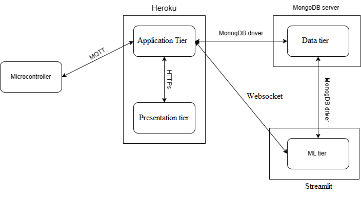
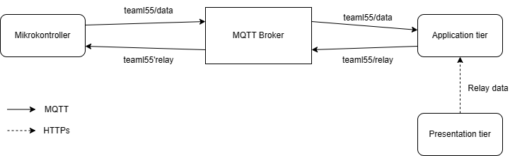

Artikel ini akan menjelaskan bagaimana cara membuat sebuah web app untuk Internet of Thing (IoT). Berikut merupakan outline dari artikel ini:
- Pernyataan Masalah. 
- Gambaran Umum.
- Flask (Back End component).
- React (Front End component).
- MongoDB (Database Component).
- ARIMA (Machine Learning Component).
- \+ Kalibrasi ADC ESP32.

## **Pernyataan Masalah**
---

## **Gambaran Umum**
---
Terdapat banyak stuktur, dan pattern yang dapat digunakan dalam membuat sebuah projek full-stack. Pada artikel ini, kita akan menggunakan **Three Tier Architecture**.

**Three Tier Archicture** merupakan arsitektur yang membagi sebuah aplikasi software ke dalam tiga tier yaitu: Presentation tier, Application Layer, dan Data tier. 
1. Presentation tier: Merupakan tier yang berisikan layer user interface, dan layer komunikasi, dimana user akan berinteraksi dengan aplikasi. Tier ini berfungsi untuk mengoleksi, dan menampilkan data untuk user.
2. Application tier: Merupakan tier yang berisikan layer yang berfungsi untuk memroses data dari user, atau database. Sehingga tier ini dapat berisikan layer business logic, dan data acces layer.
3. Data tier: Merupakan tier dimana data yang akan digunakan oleh Application tier disimpan.

Dalam arsitektur ini, semua komunikasi pada tier dimediasi oleh Application layer dikarenakan Data tier, dan Presentation tier tidak dapat berkomunikasi secara langsung. 

Untuk komunikasi antar tier, artikel ini menggunakan protokol HTTPS sebagai jembatan antara Presentation tier, dan Application tier. Sedangkan untuk komunikasi antara Data tier, dan Application tier digunakan database driver.

Berikut merupakan technology stack yang akan digunakan:
1. Presentation tier: React.
2. Application tier: Flask.
3. Data tier: MongoDB.

Karena pada projek kali ini akan menggunakan Machine Learning, maka akan ditambahkan satu tier lagi yang bernama ML tier. Tier ini dibuat karena keterbatasan resource server yang akan digunakan (karena free). 

Keseluruhan arsitektur beserta komunikasi protokol pada proyek ini dapat dilihat pada gambar 1. 

|| 
|:--:|
|<b>Gambar 1</b>. Arsitektur Sistem|

Gambar 1 memperlihatkan server yang digunakan untuk menampung tier, dan jenis protokol komunikasinya yang tertulis pada tanda panah. Variasi pada protokol komunikasi, dan server service dilakukan secara sengaja, tujuanya agar penulis dapat belajar banyak hal dalam membuat proyek ini. 

Sebagai tambahan, akan digunakan kontainer untuk satu server service yang sama. Sehingga, Application tier dan Presentation tier akan masuk ke dalam kontainer yang sama. Sedangkan, Ml tier akan masuk ke dalam kontainernya sendiri.

## **Flask**
---
Flask merupakan sebuah web framemework dari python. Pada proyek ini, Flask digunakan sebagai back end untuk Application tier. Berikut fungsi yang harus terpenuhi pada Flask:
1. Mampu mengirimkan perintah pengaktifan relay ke mikrokontroler; dan menerima data mentah sensor dari mikrokontroler. Semua komunikasi ini dilakukan dengan protokol MQTT.
2. Mampu mengirimkan, dan menerima data ke/dari MongoDB. Yaitu data mentah sensor, dan data sensor yang telah terkalibrasi lewat MongoDB driver.
3. Mampu melakukan kalibrasi pada sensor untuk mendapatkan data sensor yang telah terkalibrasi. Parameter hasil kalibrasi akan dikirimkan ke Presentation layer untuk ditampilkan user sehingga user dapat memilih untuk update parameter atau tidak.
4. Mampu mengirimkan data sensor yang telah terkalibrasi ke Presentation Layer lewat protokol HTTPs.
5. Mampu mengirimkan data sensor yang telah terkalibrasi ke Streamlit untuk diolah oleh ML tier, kemudian dapat menerima hasil olahan ML tier. Semua komunikasi dilakukan menggunakan Websocket.

Fungsi diatas, secara umum hanya merupakan manajemen komunikasi antara server service yang digunakan dengan berbagai protokol komunikasi, ditambah pemrosesan kalibrasi sensor.

### **Fungsi 1**

Untuk memenuhi fungsi 1, digunakan HiveMq sebagai MQTT broker untuk memediasi komunikasi antara Application tier, dan Mikrokontroller. Adapun topik MQTT yang akan dibuat:
- teaml55/data: Merupakan topik yang berisi data sensor dengan format data volt1:cur1:volt2:cur2. 
- teaml55/relay: Merupakan topik yang berisi perintah aktivasi relay dengan format data relay1:relay2. 

Gambar 2 menunjukkan perilaku subcribe, dan publish antara mikrokontroler dan Application tier.

|| 
|:--:|
|<b>Gambar 2</b>. Arsitektur MQTT Broker

Sebagai catatan, MQTT broker akan mengubah payload - data yang dikirimkan- menjadi byte array. Sehingga, dalam melakukan subcribe diperlukan konversi byte array ini terlebih dahulu. 

Untuk mendapatkan perintah aktiviasi relay dari user, maka diperlukan komunikasi antara Presentation tier dan Application tier, komunikasi ini dilakukan menggunakan protokol HTTPs (lihat gambar 2). 

Pada web app, akan disediakan toggle button untuk masing-masing relay, apabila user menekan click button dengan tulisan send data. Maka status toggle button ini akan dikombinasikan dalam satu Json, dan akan di-fetch ke 'api/toggle' menggunakan metode POST. Flask akan melakukan request pada 'api/toggle' untuk mendapatkan datanya.

### **Fungsi 2**

Untuk memenuhi fungsi 2, digunakan MongoDB driver untuk berinteraksi dengan mongoDB database. Pada database terdapat dua kluster yaitu data sensor mentah, dan data sensor terkalibrasi. 

Format data yang akan dikirimkan ke database dapat dilihat pada seksi MonogoDB. Pengiriman dijalankan secara sinkronus dengan alur seperti pada gambar 3.

### **Fungsi 3**

Sebelum dilakukan kalibrasi, terlebih dahulu data-data sensor difilter. Hal ini harus dilakukan karena data sensor banyak mengandung derau. Dua alasan utama: alat sensor yang kurang akurat, dan sifat non-linearitas pada Analog to Digital Converter (ADC) pada Esp32. Filter yang akan digunakan adalah **Chebyshev filter Tipe I**, dengan **Matched Z-Transform** untuk mentrasformasi filternya ke digital.

## **Kalibrasi ADC**
___

Karena nature dari ADC ESP32 yang bersifat non-linar seperti yang dibahas sebelumnya, maka diperlukan sebuah teknik untuk membuat sifat non-liner ini setidaknya mendekati linear. Pada tulisan ini digunakan pendekatan Look Up Table (LUT).

LUT merupakan sebuah teknik untuk mengakses hasil hanya dengan menggunakan indexing dari sekumpulan array. Pada kalibrasi, isi pada array biasanya merupakan nilai sensor yang benar. Karena itu, LUT tidak memerlukan komputasi sehinnga time complexity dari teknik kalibrasi ini adalah O(1).

